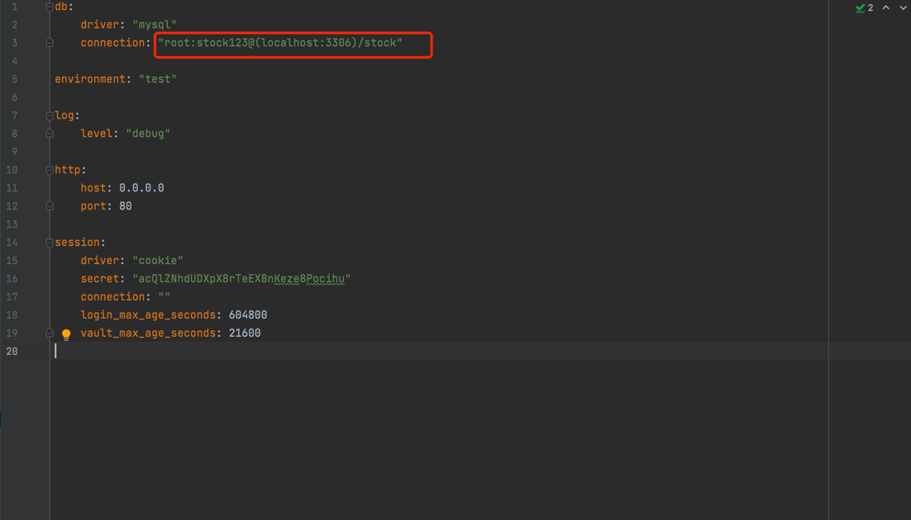
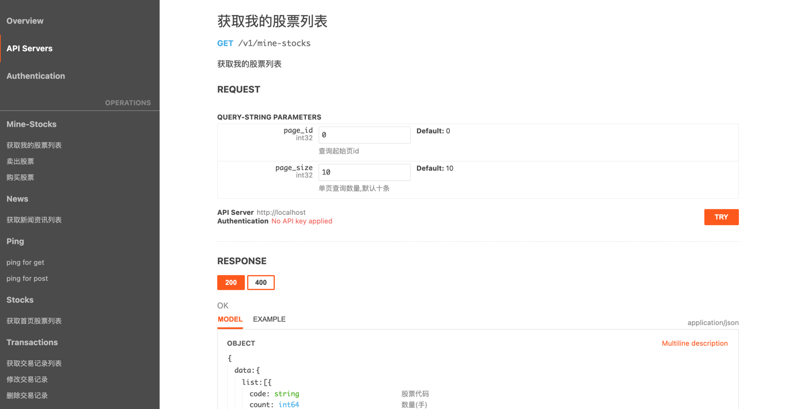

### 一、修改配置文件数据库配置
    1. 配置文件地址：.../stock-server/config/config.yml
    2. 将配置文件config.yml中db的配置地址修改为自己的mysql数据库链接配置 配置格式：user:password@(host:port)/db  如：root:stock123@(localhost:3306)/stock

### 二、数据库表构建
    在main.go文件所在目录下，执行命令
    `go run main.go  migrate`

### 三、导入测试数据至数据库相关表
    测试数据文件：news.sql、stocks.sql

### 四、运行服务
    在main.go文件所在目录下，执行命令
    `go run main.go  server`

### 五、查看接口文档（地址）

`http://localhost/static/api_docs.html`

视觉截图：

   

